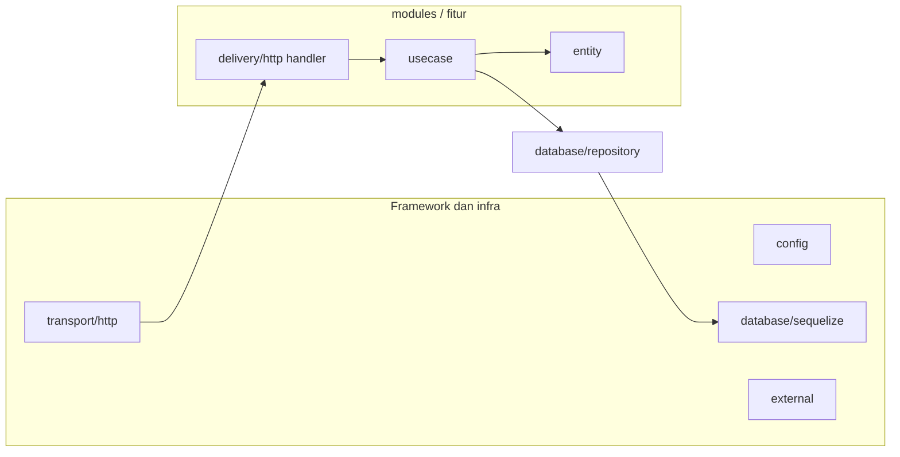

# Boilerplate Clean Architecture for Bun


[](https://github.com/ayocodingit/boilerplate-clean-architecture)
[](https://codeclimate.com/github/ayocodingit/boilerplate-clean-architecture/maintainability)
[](https://codeclimate.com/github/ayocodingit/boilerplate-clean-architecture/test_coverage)

Boilerplate berbasis **Clean Architecture** untuk runtime **Bun**, dengan lapisan yang jelas dan siap dipakai untuk pengembangan fitur baru.

---

## Daftar isi

- [Kenapa pakai boilerplate ini?](#-kenapa-pakai-boilerplate-ini)
- [Tech stack](#-tech-stack)
- [Struktur folder](#-struktur-folder)
- [Peta layer (target per folder)](#-peta-layer-target-per-folder)
- [Installasi & setup](#-installasi--setup)
- [Scripts & perintah](#-scripts--perintah)
- [Generate code (scaffolding)](#-generate-code-scaffolding)
- [Testing](#-testing)
- [Lisensi](#-lisensi)

---

## 🚀 Kenapa pakai boilerplate ini?

- **Pemisahan lapisan**: Aturan bisnis terpisah dari framework, DB, dan HTTP.
- **Mudah di-test**: Use case dan repository bisa di-test tanpa server atau DB nyata.
- **Type-safe**: TypeScript di seluruh codebase.
- **Repository independen**: Layer repository hanya bergantung pada schema/DB dan types sendiri, tidak ke module tertentu.
- **Siap dipakai**: Migrasi, validasi (Joi), logging (Winston), CORS, Swagger, cron, seed.

---

## ✨ Tech stack

| Bagian        | Teknologi        |
|---------------|------------------|
| Runtime       | Bun v1.3+        |
| Bahasa        | TypeScript       |
| Framework HTTP| ElysiaJS         |
| ORM           | Sequelize        |
| Validasi      | Joi              |
| Logging       | Winston          |
| Testing       | Bun Test         |

---

## 📂 Struktur folder

```
src/
├── app.ts                      # Entry point
├── config/                     # Konfigurasi app + validasi env
├── cron/                       # Job terjadwal (cron)
├── database/
│   ├── repository/             # Akses data per entity: repository.ts, types.ts, contract.ts (enum / kontrak nilai)
│   │   └── category/
│   └── sequelize/              # Koneksi Sequelize, model, relasi, migrasi
│       ├── models/
│       ├── migrations/
│       ├── interface.ts
│       ├── relations.ts
│       └── sequelize.ts
├── external/                   # Integrasi eksternal (contoh: redis)
├── helpers/                    # Utility (request params, validasi, date, regex, dll)
├── modules/                    # Fitur/domain (entity, usecase, delivery/http)
│   └── category/
├── pkg/                        # Shared package (logger, jwt, status code, error, i18n)
├── transport/                  # Setup HTTP (Elysia), middleware
├── migrater.ts                 # CLI migrasi DB (up/down)
└── examples/                   # Contoh (curl, upload file); lihat README di folder
```

---

## 🧭 Peta layer (target per folder)

Bagian ini untuk **cepat orientasi** (termasuk kalau kerja ala “vibe code”): kamu cukup tahu **file yang kamu sentuh itu “masuk layer mana”** dan **boleh ngapain / jangan ngapain**. Template Plop tidak perlu diubah; yang perlu konsisten adalah **arah dependency** (lihat diagram di bawah).

### Aturan emas (satu kalimat)

**Request masuk dari HTTP → Handler → Use case → Repository → DB.**  
Jangan balik arah (misalnya repository tidak boleh import handler atau Elysia).

### Tabel: folder → layer → tugas

| Layer (istilah umum) | Lokasi di repo ini | Target / tugas | Hindari |
|----------------------|-------------------|----------------|---------|
| **Frameworks & drivers** | `transport/`, `config/`, `database/sequelize/`, `external/`, `app.ts` | Wiring server (Elysia), plugin global, koneksi DB, env, Redis, entry app | Taruh aturan bisnis di sini |
| **Interface adapters (masuk)** | `modules/<x>/delivery/http/` | Terjemahin HTTP (query, body, params) → panggil use case; format response | Query DB langsung, logic bisnis berat |
| **Application (use cases)** | `modules/<x>/usecase/` | Orkestrasi bisnis satu fitur: panggil repo(s), validasi aturan domain | Import `elysia`, `Context`, atau raw SQL di sini |
| **Domain (entity)** | `modules/<x>/entity/` | Bentuk data + schema validasi request (Joi) untuk fitur itu | Akses DB atau HTTP |
| **Interface adapters (keluar)** | `database/repository/<entity>/` | CRUD/query Sequelize; `types.ts` + **`contract.ts`** (enum / kontrak nilai per entity) | Import module `modules/...` |
| **Shared kernel** | `helpers/`, `pkg/` | Util murni (parse query, error, logger, JWT) yang dipakai banyak layer | Jadi “tempat” fitur bisnis baru |

### Cheat sheet: “mau nambah fitur, edit mana?”

1. **Kolom/tabel baru** → `make:model` → `database/sequelize` + `database/repository`.
2. **Endpoint + alur bisnis** → `make:module` → `modules/<nama>/` (entity → usecase → handler).
3. **Daftarkan module** → `src/app.ts` (generator biasanya sudah menyisipkan).
4. **Global HTTP (CORS, error shape, `/docs`)** → `transport/http/http.ts` saja.

### Diagram dependency (arah panah = “boleh bergantung pada”)



Ringkasnya: **pusat ada di use case**; HTTP dan DB hanya adapter. Dependency mengalir ke dalam: entity dan use case tidak boleh bergantung pada Elysia atau detail HTTP.

---

## 🛠️ Installasi & setup

**Prasyarat:** [Bun](https://bun.sh/) v1.3+

```bash
git clone https://github.com/ayocodingit/clean-architecture-bun.git
cd clean-architecture-bun
bun install
cp .env.example .env
# Edit .env (DB, JWT, dll)
bun run migrate
```

---

## 🏃 Scripts & perintah

| Perintah | Deskripsi |
|----------|-----------|
| `bun run dev` | Jalankan app (watch mode) |
| `bun run build` | Build production (minify) ke `./build` |
| `bun start` | Jalankan hasil build (`./build/app.js`) |
| `bun run migrate` | Jalankan migrasi DB (up) |
| `bun run migrate:rollback` | Rollback satu migrasi (down) |
| `bun run make:model` | Generate model + migrasi + repository (lihat bawah) |
| `bun run make:module` | Generate module (usecase + handler + entity) |
| `bun run make:migration` | Generate file migrasi kosong |
| `bun run make:cron` | Generate file cron kosong |
| `bun run seed:run -- --name=<nama>` | Jalankan seed (`src/database/seeds/<nama>.seed.ts`) |
| `SEED_NAME=<nama> bun run seed:run` | Alternatif tanpa argumen CLI (berguna di CI / script) |
| `bun run cron:run -- --name=<nama>` | Jalankan cron (`src/cron/<nama>.cron.ts`) |
| `CRON_NAME=<nama> bun run cron:run` | Alternatif tanpa argumen CLI |
| `bun test` / `bun run test:unit` | Jalankan test (helpers) |
| `bun run lint` | Cek format (Prettier) |
| `bun run lint:fix` | Perbaiki format otomatis |

---

## 🛠️ Generate code (scaffolding)

Semua generator memakai **Plop** dan menyesuaikan struktur Clean Architecture di repo ini.

### 1. `bun run make:model` — Layer database + repository

Menambah **satu entity** di sisi persistence:

- **Migrasi** – `src/database/sequelize/migrations/<timestamp>-<name>.ts` (up/down)
- **Model Sequelize** – `src/database/sequelize/models/<repository>.ts`
- **Repository** – `src/database/repository/<repository>/repository.ts` (class `XxxRepository`)
- **Types repository** – `src/database/repository/<repository>/types.ts` (`CreateXxxInput`, `UpdateXxxInput`, `XxxFilter`)
- **Contract (enum / nilai tetap)** – `src/database/repository/<repository>/contract.ts` (starter dari generator; sesuaikan dengan kolom DB)

Model dan repository otomatis didaftar di `src/database/sequelize/interface.ts` dan `sequelize.ts`.

**Prompt:**

- Migration name (contoh: `create-posts`)
- Repository name (contoh: `post`) → dipakai untuk nama folder, class, dan model
- Table name (contoh: `posts`) → nama tabel di DB

**Contoh:** Repository name `post`, table `posts` → folder `repository/post/`, model `models/post.ts`, tabel `posts`.

---

### 2. `bun run make:module` — Layer bisnis + HTTP

Menambah **satu fitur** (module) di sisi aplikasi:

- **Entry module** – `src/modules/<name>/<name>.ts` (registrasi route & inject repository, usecase, handler)
- **Usecase** – `src/modules/<name>/usecase/usecase.ts`
- **Handler HTTP** – `src/modules/<name>/delivery/http/handler.ts`
- **Entity** – `src/modules/<name>/entity/interface.ts` dan `schema.ts` (Joi)

Module otomatis di-import dan didaftar di `src/app.ts`.

**Prompt:**

- Module name (contoh: `post`) → route mis. `/v1/posts`, `/v1/public/posts`
- Repository name(s) (opsional, dipisah koma)  
  contoh: `post` atau `post,user` atau kosong

**Perilaku generator:**

- Jika diisi **1 repository** (contoh `post`): template usecase CRUD otomatis terhubung ke `PostRepository`.
- Jika diisi **lebih dari 1 repository** (contoh `post,user`) atau **kosong**: semua repository (jika ada) tetap di-import/inject, tetapi method usecase dibuat sebagai skeleton (`NOT_IMPLEMENTED`) agar bisa kamu isi manual sesuai flow bisnis module.

**Penting:** Repository yang kamu isi tetap harus sudah ada (buat dulu via `make:model` atau manual).

---

### 3. `bun run make:migration` — Hanya file migrasi

Hanya menambah **satu file migrasi** di `src/database/sequelize/migrations/` (up/down kosong, isi manual).

**Prompt:** Migration name, Table name.

---

### 4. `bun run make:cron` — Job cron

Menambah **satu file cron** di `src/cron/<name>.cron.ts`.

**Prompt:** Cron job name (contoh: `sync-users`).

---

## 🧪 Testing

Test fokus ke helper di `src/helpers`:

```bash
bun test
# atau
bun run test:unit
```

---

## 📄 Lisensi

MIT.
